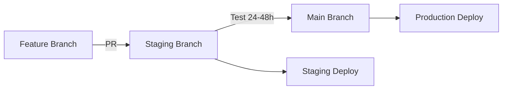

# Staging Environment Guide

This guide explains how to use and contribute to the HODL Vault staging environment on Base Sepolia testnet.

## Overview

The staging environment allows contributors to:
- Test new features on Base Sepolia testnet before mainnet deployment
- Preview changes in a production-like environment
- Collaborate on features without affecting the main production site
- Validate smart contract interactions with testnet tokens

## Architecture

```
Production (main branch) → Base Mainnet → base-hodl.xyz
Staging (staging branch) → Base Sepolia → base-hodl-staging.vercel.app  
Development (feature branches) → Base Sepolia → preview-*.vercel.app
```

### Two Separate Vercel Projects

1. **Production Project**: `base-hodl-xyz`
   - Deploys from `main` branch
   - Uses Base mainnet
   - Live at https://base-hodl.xyz

2. **Staging Project**: `base-hodl-staging`
   - Deploys from `staging` branch
   - Uses Base Sepolia testnet
   - Live at https://base-hodl-staging.vercel.app

## Quick Start for Contributors

### 1. Setup Local Environment

```bash
# Clone the repository
git clone https://github.com/ivan-singabytes-projects/base-hodl-xyz.git
cd base-hodl-xyz

# Install dependencies
npm install

# Copy staging environment variables
cp .env.staging .env.local

# Update .env.local with your values:
# - NEXT_PUBLIC_VAULT_ADDRESS: 0x71Da6632aD3De77677E82202853889bFC5028989
# - NEXT_PUBLIC_ONCHAINKIT_API_KEY: [Your API key]
# - NEXT_PUBLIC_WALLET_CONNECT_PROJECT_ID: [Your WC ID]
```

### 2. Get Sepolia Testnet Tokens

1. **Get Base Sepolia ETH**: https://www.coinbase.com/faucets/base-ethereum-goerli-faucet
2. **Get test USDC**: Deploy TestERC20.sol or use existing test tokens
3. **Add Base Sepolia to your wallet**:
   - Network Name: Base Sepolia
   - RPC URL: https://sepolia.base.org
   - Chain ID: 84532
   - Currency Symbol: ETH
   - Block Explorer: https://sepolia.basescan.org

### 3. Development Workflow

```bash
# Create a feature branch from staging
git checkout staging
git pull origin staging
git checkout -b feature/your-feature-name

# Run development server with staging config
npm run dev:staging

# Test your changes locally
npm run test:staging

# Commit and push your changes
git add .
git commit -m "feat: your feature description"
git push origin feature/your-feature-name
```

### 4. Creating a Pull Request

1. Push your feature branch to GitHub
2. Create a PR targeting the `staging` branch (not `main`)
3. Fill out the PR template completely
4. Wait for automated preview deployment on Vercel
5. Share the preview URL for testing

## Staging Contract Information

### Current Staging Contract
- **Network**: Base Sepolia (Chain ID: 84532)
- **Contract Address**: `0x71Da6632aD3De77677E82202853889bFC5028989`
- **Block Explorer**: [View on Basescan](https://sepolia.basescan.org/address/0x71Da6632aD3De77677E82202853889bFC5028989)

### Deploying a New Staging Contract

```bash
# Deploy to Base Sepolia
npx hardhat run scripts/deploy.js --network baseSepolia

# Verify the contract
npx hardhat run scripts/verify.js --network baseSepolia

# Update .env.staging with new contract address
```

## Vercel Deployment Setup

### Automatic Deployments

The environments use separate Vercel projects:

1. **Staging Branch** → Deploys to base-hodl-staging.vercel.app (staging project)
2. **Feature Branches** → Create preview deployments on staging project
3. **Main Branch** → Deploys to base-hodl.xyz (production project)

### Manual Deployment

```bash
# Deploy to staging manually
npm run deploy:staging

# This will:
# 1. Build with staging configuration
# 2. Deploy to Vercel with staging environment
# 3. Use variables from .env.staging
```

### Vercel Environment Variables

Set these in your Vercel project settings for staging:

```
NEXT_PUBLIC_VAULT_ADDRESS=[Sepolia contract address]
NEXT_PUBLIC_ONCHAINKIT_API_KEY=[Your API key]
NEXT_PUBLIC_WALLET_CONNECT_PROJECT_ID=[Your WC ID]
NEXT_PUBLIC_URL=https://staging-base-hodl.vercel.app
NEXT_PUBLIC_IS_STAGING=true
```

## Testing on Staging

### Automated Tests

```bash
# Run staging environment tests
npm run test:staging

# This checks:
# - Environment variables
# - Contract deployment
# - RPC connectivity
# - Contract interface
```

### Manual Testing Checklist

- [ ] Connect wallet (MetaMask, Coinbase Wallet, etc.)
- [ ] Switch to Base Sepolia network
- [ ] Create a lock with test tokens
- [ ] View lock in dashboard
- [ ] Test countdown timer
- [ ] Test social sharing
- [ ] Verify Farcaster frames
- [ ] Test claim functionality (after lock expires)
- [ ] Check mobile responsiveness
- [ ] Verify theme switching

## Environment Configuration

### Environment Detection

The app automatically detects the environment:

```typescript
// app/lib/config.ts
isProduction: mainnet deployment
isStaging: Sepolia testnet staging
isDevelopment: local development
```

### Network Badge

Staging deployments show a yellow "STAGING" badge to indicate testnet environment.

## Troubleshooting

### Common Issues

1. **Contract not found**: Ensure the contract is deployed to Sepolia and address is correct in .env.staging

2. **No testnet tokens**: Get Base Sepolia ETH from the Coinbase faucet

3. **Vercel deployment fails**: Check that all environment variables are set in Vercel dashboard

4. **Transaction fails**: Ensure you're on Base Sepolia network (Chain ID: 84532)

### Debug Mode

Enable debug logging in staging:
```javascript
// In browser console
localStorage.setItem('debug', 'true');
```

## Best Practices

### For Contributors

1. **Always branch from staging** for new features
2. **Test thoroughly** on Sepolia before requesting merge
3. **Update documentation** when adding new features
4. **Include tests** for new functionality
5. **Use semantic commit messages** (feat:, fix:, docs:, etc.)

### For Maintainers

1. **Merge to staging first** for testing
2. **Wait 24-48 hours** before merging staging to main
3. **Tag releases** when merging to production
4. **Monitor staging** for issues before production deployment
5. **Keep staging contract** updated with latest changes

## Deployment Flow



## Resources

- [Base Sepolia Faucet](https://www.coinbase.com/faucets/base-ethereum-goerli-faucet)
- [Base Sepolia Explorer](https://sepolia.basescan.org)
- [Vercel Documentation](https://vercel.com/docs)
- [Project README](./README.md)
- [Contributing Guide](./CONTRIBUTING.md)

## Support

For issues or questions:
1. Check existing [GitHub Issues](https://github.com/your-org/base-hodl-xyz/issues)
2. Join our [Discord/Telegram]
3. Create a new issue with the `staging` label

---

**Remember**: The staging environment uses Base Sepolia testnet. Never use real funds or mainnet tokens in staging!